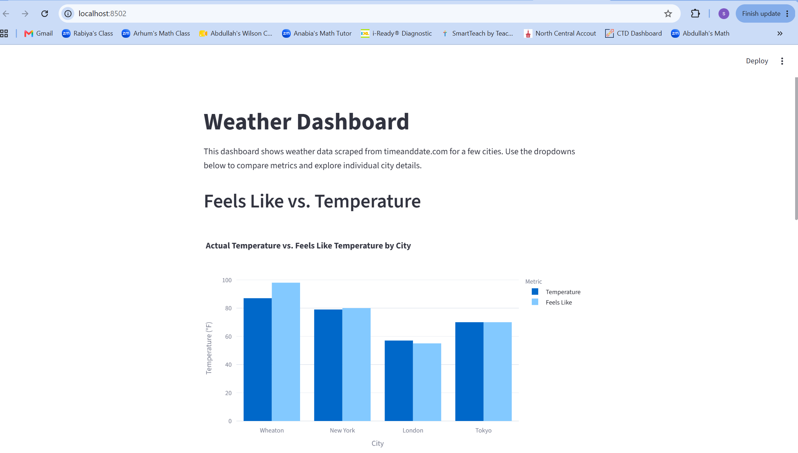
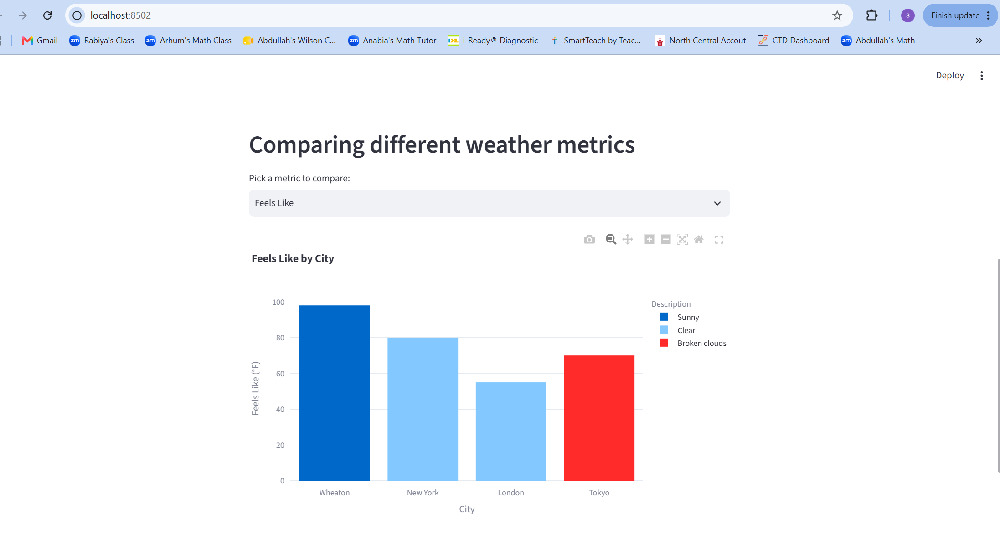
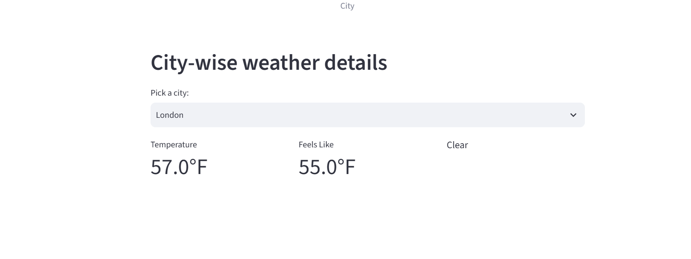

# Web_Scraping_Capstone_Project

# Weather Dashboard

## Summary

This project scrapes weather data for several cities from timeanddate.com using Selenium, cleans the data with Pandas, stores it in a SQLite database, and displays it in an interactive Streamlit dashboard. The dashboard lets users compare weather metrics across cities and view details for a specific city.

## Setup Instructions

1. Clone this repository.
2. Create a virtual environment: python -m venv .venv
3. Activate the virtual environment: .venv\Scripts\Activate.ps1
4. Install the required packages: pip install -r requirements.txt
5. Run the scraping script to collect and clean the weather data: world_weather.py
6. Run the Streamlit dashboard: streamlit run streamlit_app.py
7. Open your browser to `http://localhost:8502` to view the dashboard.

## Features

- Grouped Bar Chart comparing actual temperature vs. feels-like temperature
- Bar chart comparing a selected weather metric across all cities
- City detail view with temperature, feels-like, and condition

## Screenshots

